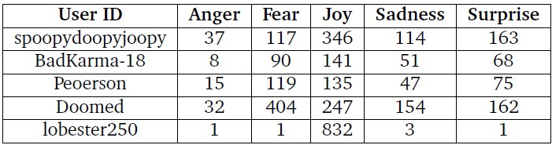
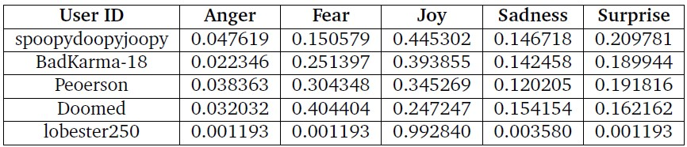
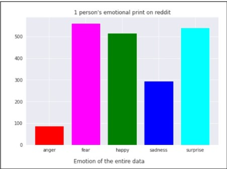
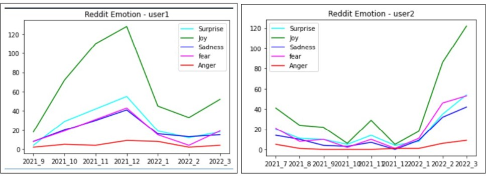
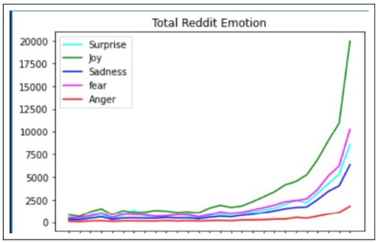

# Association-Emotions

The primary objective of this project is to utilize a random set of texts using Social Media APIs to draw the association probabilities between two or more kinds of emotions. This involves applying Sentiment Analysis on the data for recognizing the emotion exhibited. Statistics and Machine Learning techniques are then used on the labeled emotions to identify the association rules. The results denote the probabilities by which one type of sentiment is likely to produce other kinds.

This repository includes the Python Notebook with the code implementation, the source files and the report submitted for the assignment. Source files are:
- **Code Files:**
  -	Reddit_Emotional_Analysis.ipynb: Notebook has 3 parts: the api calls, the Reddit data preprocessing with the emotion recognition and visualizations.
    - Part 1 requires no extra data, it stores the results in csv files.
    - Part 2 requires the files `consol_reddit_comments.csv`, `redditor_info_consol.csv` and it creates `consol_reddit_emotion.csv`.
    - Part 3 requires `consol_reddit_emotion.csv`, `tokenizer.pickle` and `emotion_model.h5`.
  -	Apriori_Algorithm.ipynb: Python notebook that includes the code for the implementation of the apriori algorithm. Takes as input the file `consol_reddit_emotion.csv` and generates the association rules.
  -	FPGrowth_Algorithm.ipynb: Python notebook that includes the code for the implementation of the frequent pattern growth algorithm. Takes as input the file `consol_reddit_emotion.csv` and generates the association rules.
- **Data Files:**
  -	consol_reddit_comments.csv: Input file for emotional analysis notebook.
  -	redditor_info_consol.csv: Input file for emotional analysis notebook.
  -	consol_reddit_emotion.csv: File that contains the results of the sentiment analysis algorithm and is used as input for the association rules algorithms.
- **Additional Files:**
  -	tokenizer.pickle, emotion_model.h5: Additional files required for running the notebook for emotion analysis.

# 1. Introduction

Humans exhibit a wide range of emotions while responding to stimuli and information. According to Plutchik’s
wheel of emotions, these myriads of emotions can be broadly classified under eight kinds – joy, anger, fear,
sadness, surprise, trust, disgust, anticipation. For the course of our project, due to the limitations of data,
the number of classes have been reduced to primary five – joy, anger, surprise, fear, sadness or six including
disgust.

Social Networking is a platform for many of us to respond to events happening around the world, share
and comment on opinions. Platforms like Twitter, Facebook and Reddit witness millions of such comments
every day. These comments carry forward users’ emotions. Hence this project focuses on capitalizing such
information to understand the patterns of association in human emotions.

# 2. Problem Statement

The primary objective of this project is to utilize a random set of texts using Social Media APIs to draw the
association probabilities between two or more kinds of emotions. This involves applying Sentiment Analysis
on the data for recognizing the emotion exhibited. Statistics and Machine Learning techniques are then used
on the labeled emotions to identify the association rules. The results denote the probabilities by which one
type of sentiment is likely to produce other kinds.

# 3. Data Description

The data for this project is a large set of comments taken from random subreddits using the Reddit API. The
dataset contains a list of multiple comments for a group of users. The dataset comprises of approximately
300,000 comments distributed over 500 users.

## 3.1 Data Pre-processing

The comments taken from Reddit users are usually long and contain multiple sentences. Each of these sentences
can contain multiple emotions as the commenter shifts his wording or subject or language of what he/she is
planning to communicate. Hence, each comment must be split by sentences to later apply sentiment analysis on
each of them to cover all the emotions acted on by the user. Splitting the comments is also important since sentiment
analysis algorithm that will be used is trained on tweets which are also shorter than the Reddit comments.

Further, like any other social media, most accounts use emoticons to be more specific or to make their responses
short or attractive. These emoticons are essentially represented as groups of special characters in the dataset
collected and therefore needed to be removed as a part of data processing.

Finally, the text from the comments contained many redundant characters. Formatting the data involved
removing url links, random punctuation marks, capitalizations and extra white spaces

# 4. Features

Initially, the data extracted from the API consisted of the following columns - commented ,author, body,
created utc, distinguished, edited, is submitter, link id, parent id, saved score, stickied, subreddit id. These
features provide information about the user’s ID, whether the comment has been edited, the comment date,
the subreddit under which the comment has been posted etc. However, for this project ‘body’(comment text) ,
‘author’(user id) ,’create utc’(comment date) were majorly utilized.

# 5. Method
## 5.1 Emotion Recognition

Before we understand the dependency of emotions, it’s a prerequisite to recognize the primary emotions
exhibited by a specific user. We applied two different approaches for recognizing multiple emotions from the
reddit comments.

### 5.1.1 Soft Labelling

We used a twitter dataset with approximately 200,000 tweets gold labelled with 6 emotions. After removing
punctuation, spaces, capitalization, truncating to maximum size, the vocabulary is tokenized into numerical
codes. An LSTM model is then trained on the data to identify emotions in text. This model is used to soft label
Reddit data. Since Twitter and Reddit posts’ lengths are different, the Reddit comments needed to be split into
sentences. Then the model is used on each sentence to obtain the emotion. Finally, the comment emotion is
set to the one that appeared the most.

### 5.1.2 Text2Emotion

This is a pre-trained Python package for emotion detection with 5 emotions. This package processes any
textual message and recognizes the emotions embedded in it. This is not a time-series recognition. Two
approaches were taken while applying this algorithm:

• Considering the emotion with the maximum value.

• Considering the probability of each emotion and adding up the probabilities.

### 5.1.3 Grouping Users’ Emotions

The users’ emotions were recognized with the afore-mentioned algorithms. Each user is assigned counts for
every kind of emotion that has been recognized from the corresponding account tweets, an example is shown
in Table 1. These counts are then used to calculate the individual emotion probabilities for each emotion per
user, as shown in Table 2, which are then incorporated into the association model.

Table 1: Count of posts by emotion for each user from Text2Emotion - Maximum algorithm.

Table 2: Probabilities by emotion for each user from Text2Emotion - Maximum algorithm.

## 5.2 Association Rules

Association rule-mining is a data mining approach used to explore and interpret large transactional datasets
to identify unique patterns and rules [1]. These datasets contain a large amount of transactions where each
of them include a list of items. It is important to note that these transactions only indicate which items are
included, not the amount in each one.

For our project, we will consider our transactions as each of the users and the items as the emotions. Since
most users will have at least one comment of each emotion, this will generate a few challenges when applying

the existing algorithms, because for our project it is significant the value of either the count or probability for
each emotion that we generated by the sentiment analysis algorithm.

Some important metrics to consider for association rule algorithms are described below [2].

• Support count(E1): is the number of transactions containing Emotion 1.

• Support(E1): is the support count divided by the number of total transactions.
 - Support(E1) = (Number of transactions containing Emotion 1)/(Total number of transactions)

• Confidence(E1 → E2): indicates out of all the times emotion 1 appears, how many times is also emotion 2 present.
 - Confidence(E1 → E2) = (Number of transactions containing E1 and E2)/(Number of transactions containing E1)

• Lift(E1 → E2): indicates how often the emotions appear together in comparison to what is expected by chance.
 - Lift(E1 → E2) = (Confidence(E1 → E2))/ (Support(E2))

We applied two association rule algorithms to identify correlation between the emotions exhibited in the posts.
We generated the association rules from the results of the three sentiment analysis approaches. The results
shown in the next sections will be regarding the Text2Emotion - Maximum approach.

### 5.2.1 Apriori Algorithm

The Apriori algorithm focuses on the most frequent items (in this case emotions) to identify rules between
them. The approach of this algorithm is to take the most frequent items by highest support count and create
combinations between them, from all these possible combinations it generates the rules by maintaining the
most frequent combinations, measured by using metrics such as support, confidence and lift as described
above [2].

As mentioned previously, since the structure of the dataset is not exactly as what the Apriori algorithm expects,
if we were to apply it as is, most users would have a list of all emotions, and the algorithm would not provide
any useful insights.

Therefore, we decided to implement a custom version of the algorithm by following the same process but
multiplying by probabilities in each step of the support count calculation, instead of just performing the simple
count. We created all possible combinations of up to three emotions and generated the association rules.
Finally, we kept those which had the highest value of confidence, ordering the results by lift. This means that
we are keeping those rules which appear more frequently, but we see the results in order of which rules are
appearing more than they would by chance.

### 5.2.2 Frequent Pattern Growth Algorithm

The Frequent Pattern Growth algorithm (also known as FPGrowth) was created as an improvement to the
Apriori algorithm, to improve efficiency. As a result it builds a tree with associations in branches based on
the transactions from the dataset, using the same metrics described previously to identify the most frequent
emotion rules [3].

Similar to the challenge presented above for the application of the Apriori algorithm, the direct application of
the FPGrowth algorithm to our current dataset will most likely result in one unique branch with all emotions.
This is because all users would have at least one post on each emotion and this would be the pattern detected.

For this case, we decided instead to try a different approach and transform the data set to suit the default
algorithm. For this purpose, we created levels of emotions to simulate a difference between the items of each
user (concatenating the emotion name and the level tag). The levels of emotions defined are described below.
The tag ranges are not evenly distributed because lower values are more common in the dataset, therefore
distributing the ranges equally would result in most items tagged as low or mid-low and very few in the other
categories.

• Low (L): 0 - 0.19

• MidLow (ML): 0.2 - 0.29

• Mid (M): 0.3 - 0.39

• MidHigh (MH): 0.4 - 0.59

• High (H): 0.6 - 1

After updating the dataset, each user would contain a list of items indicating for each emotion the level.
From this dataset we were able to apply the predefined FPGrowth function from pyfpgrowth library [4] and
incorporated association rules with highest confidence, ordered by lift.

# Results
## Sentiment Analysis

As a result of the sentiment analysis processes we could see an overview of how the emotions are displayed for
this specific data set. Below we present the most relevant graphs that show how these emotions are distributed
for the Text2Emotion - Maximum approach. First, Plot a and Plot e show how the emotions are represented
and distributed for all users. Then, Plot b, Plot c and Plot d display the same distributions for individual
random users over several months to see what is the common emotion for a user.

(a) Distribution of emotions for all users

(b) Distribution of emotions for one user

(c) Time Series of emotion for 2 random users

(d) Time Series of emotion for all users

